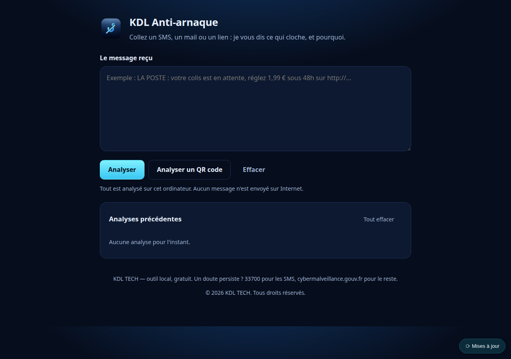

[Français](README.md) · **English**

# KDL Anti-arnaque

Paste a suspicious text message, email or link. The tool tells you what is wrong
with it — **and why**. Everything runs on your own machine: no message is ever
sent over the internet.

```bash
npm install && npm start        # then http://127.0.0.1:4210
```



<sub>The interface is in French.</sub>

---

## What it actually answers

Real output for a classic phishing text:

> **Very likely a scam** — score 100/100
>
> **"laposte" appears in the address, but the site is not theirs.**
> The real site is `laposte.fr`. Here, the domain actually visited is
> `laposte-colis.tk`. Putting a well-known name to the left in an address is the
> most common phishing trick: only the part just before the first slash counts.

That is the whole point: **it does not stop at a verdict, it teaches the rule**.
Someone who reads that explanation will recognise the next scam on their own,
without the tool.

## What it looks at

| | |
|---|---|
| **Impersonated brands** | a known name placed to the left of the real domain |
| **Suspicious domains** | risky TLDs, misleading subdomains, bare IP addresses |
| **Pressure tactics** | urgency, threat of charges, short deadlines |
| **QR codes** | decoded locally, then the address is analysed as a link |
| **History** | your previous analyses stay on the machine |

Every signal carries a weight and a severity, and the verdict explains which ones
counted. Nothing is a black box.

## Why it is offline

A tool that analyses your texts and emails **must not send them anywhere**. That
would be the whole problem: you would hand a third party exactly what you are
trying to protect.

No network requests, no API key, no account. Turn off your Wi-Fi and it works
identically.

## What it does not do

It does not replace your judgement. A message can be fraudulent without carrying
any known signal, and a legitimate one can trigger a few.

It does not check whether a site is live, never visits a link, and reports
nothing to the authorities. **If in doubt in France: 33700 for text messages,
cybermalveillance.gouv.fr for everything else.**

## Install (version 1.1)

Downloads: [GitHub releases](https://github.com/Kdl-Tech/kdl-anti-arnaque/releases).

| System | File | Status |
|---|---|---|
| Debian / Ubuntu / Linux Mint (64-bit) | `kdl-anti-arnaque_1.1.0_amd64.deb` | tested (Linux Mint 22) |
| Windows 10 / 11 (64-bit) | `KDL-Anti-arnaque-Setup-1.1.0.exe` | tested (Windows 11, Smart App Control on) |
| macOS | from source (`npm install && npm start`) | no 1.1 package |

- **Linux**: `sudo apt install ./kdl-anti-arnaque_1.1.0_amd64.deb`, then *KDL Anti-arnaque*
  in the menu. Remove: `sudo apt remove kdl-anti-arnaque`.
- **Windows**: per-user install, no administrator rights; Start menu and Settings → Apps
  entry. The installer is **not code-signed**: Windows may show "Windows protected your
  PC — unknown publisher" ("More info" → "Run anyway").
- The app opens in your browser, without a window. To quit: **Fermer KDL Anti-arnaque**
  button at the bottom of the page.
- History and log: `~/.local/share/KDL/Anti-arnaque` or `%LOCALAPPDATA%\KDL\Anti-arnaque`.
  **Uninstalling does not delete them.**
- Ships the official, unmodified Node.js runtime.

## KDL Toolbox integration

Local API documented in [docs/INTEGRATION.md](docs/INTEGRATION.md) (French): analyses a
message without storing it, for local programs only (web pages are refused).

## From source

Node.js 18 or newer. No network dependency. `npm test` runs the tests.

## Licence

MIT.

---

By [**KDL TECH**](https://kdl-tech.fr) — IT support, software development,
security. Guadeloupe and remote.
